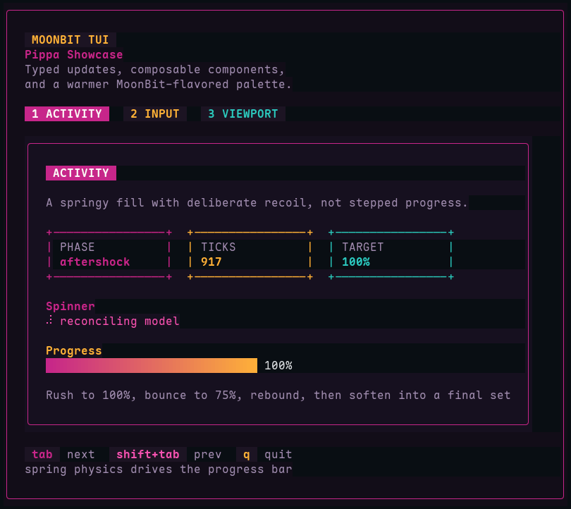

# Pippa

A terminal UI framework for [MoonBit](https://www.moonbitlang.com/), inspired by
[bubbletea](https://github.com/charmbracelet/bubbletea) (Go) and the
[Elm Architecture](https://guide.elm-lang.org/architecture/).



## Overview

Pippa provides a **Model–Update–View** pattern where:

- **Model** — application state is a plain struct.
- **Msg** — updates are driven by typed messages (key presses, resize, timers,
  custom events).
- **View** — the view function renders state to a string of ANSI-formatted
  output.

The runtime handles raw terminal mode, input parsing, and efficient
diffing and re-rendering, so library users only think about state transitions
and string output.

A component library ships alongside the core — spinners, text inputs, textareas,
lists, selection lists, tables, paginators, viewports, timers, stopwatches,
file pickers, and animated progress bars — each implemented as composable
Models that can be embedded in larger applications.

A richer `styling` package is also included for layout and visual treatment:
hex/RGB colors, borders, padding, margins, joins, placement, and higher-level
composition primitives.

## Quick Start

```bash
moon test
moon run src/examples/showcase
```

The showcase example exercises the runtime, components, styling, spring
animation, focus handling, and viewport behavior.

## Project Structure

```text
src/                          # Source root (moon.mod.json → source: "src")
├── moon.pkg                  # Core library package
├── types.mbt                 # Cmd, UpdateResult, WindowSize, Program
├── message.mbt               # KeyMsg, MouseMsg, InputEvent
├── command.mbt               # Command helpers and composition
├── program.mbt               # Program[Model, Msg] entry point
├── ansi.mbt                  # ANSI escape sequence helpers
├── component/                # Composable component sub-package
│   ├── moon.pkg
│   └── ...                   # Spinner, textarea, viewport, progress, etc.
├── styling/                  # Higher-level styling and layout package
│   ├── moon.pkg
│   └── styling.mbt
└── examples/
    ├── hello/                # Minimal example app
    └── showcase/             # Rich interactive demo
```

## Development

```bash
moon check          # Type-check the project
moon fmt            # Format all source files
moon info           # Refresh generated package interfaces
moon test           # Run all tests
moon test --update  # Run tests and update snapshots
moon run src/examples/hello  # Run the hello example
moon run src/examples/showcase  # Run the showcase demo
```

## License

Apache-2.0
